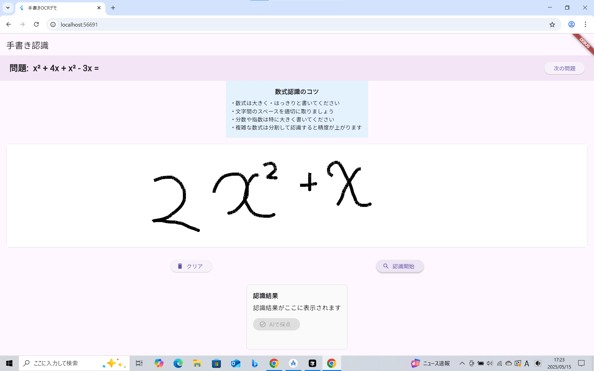
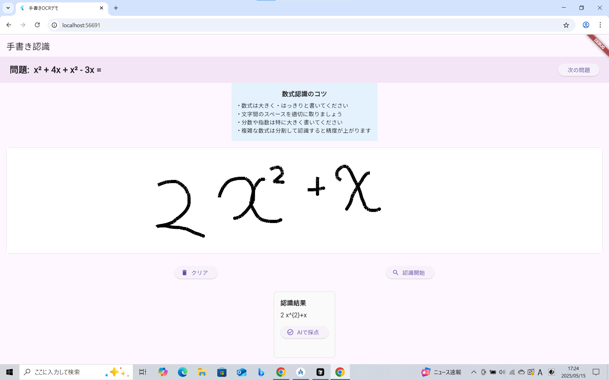
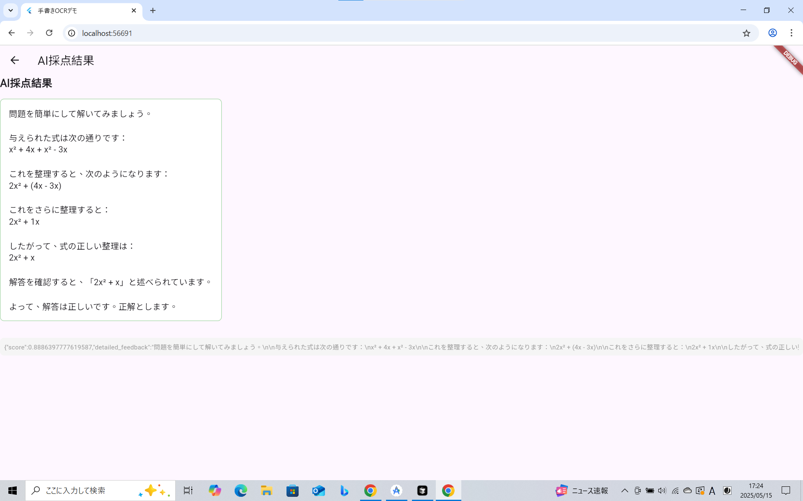

# helper_for_study

## 概要
手書き数式認識とRAG（Retrieval-Augmented Generation）によるAI採点・解説生成を行うFlutterアプリです。

---

## 主な機能

1. **手書き数式認識**  
   画面上で数式を手書き入力できます。

   

2. **数式のLaTeX変換と確認**  
   認識した数式をLaTeX形式に変換し、採点前に確認できます。

   

3. **AIによる採点結果と解説表示**  
   AIが解答を採点し、詳細な解説を日本語で表示します。

   

---

## Getting Started

このプロジェクトはFlutterアプリのスターターテンプレートです。

### 開発を始めるには

- [Lab: Write your first Flutter app](https://docs.flutter.dev/get-started/codelab)
- [Cookbook: Useful Flutter samples](https://docs.flutter.dev/cookbook)

### 公式ドキュメント

Flutter開発の詳細は[公式ドキュメント](https://docs.flutter.dev/)をご覧ください。
